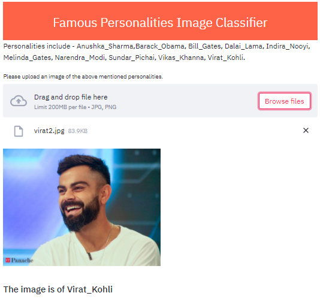

# Famous-Personalities-Image-Classifier
## Image Classifier for 10 of world's famous personalities shown below.

### To run the app locally--
#### 1.Open Anaconda Prompt.
#### 2.Install streamlit library using "pip install streamlit".
#### 3.Go to the directory containing app.py and run this command on prompt "streamlit run app.py"

## Demo-

